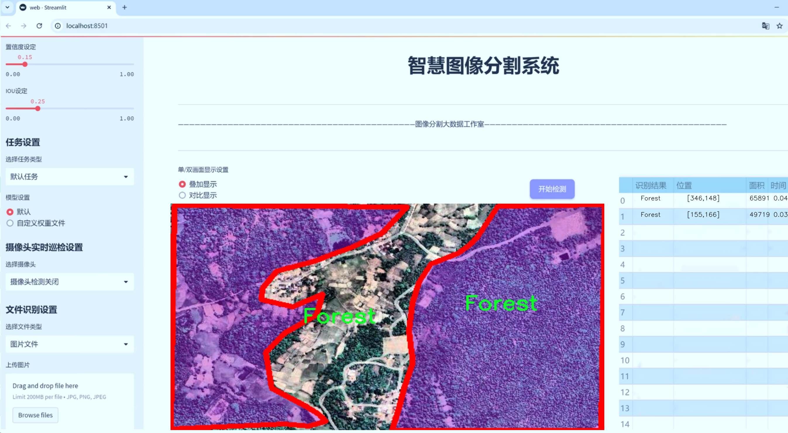
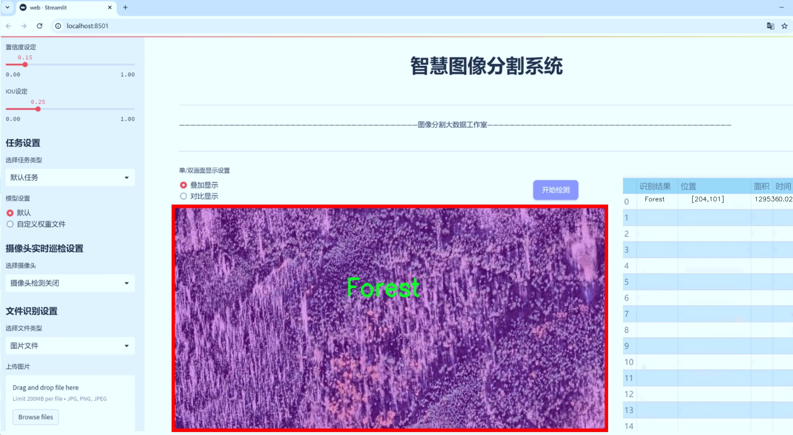
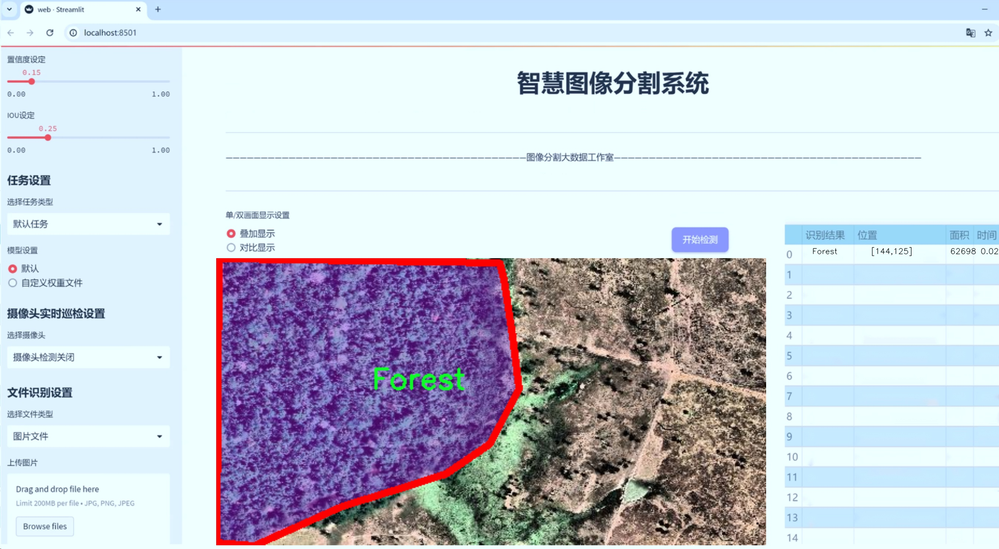
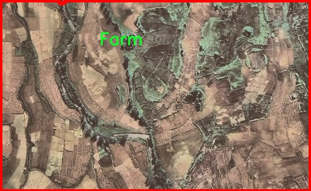
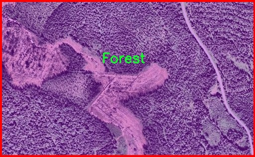
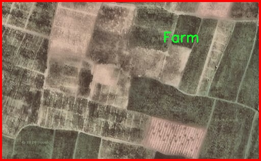
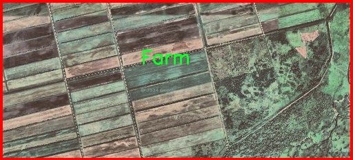
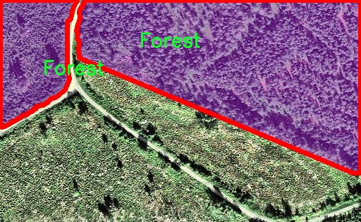

# 遥感农田森林岩石图像分割系统： yolov8-seg-C2f-DCNV2

### 1.研究背景与意义

[参考博客](https://gitee.com/YOLOv8_YOLOv11_Segmentation_Studio/projects)

[博客来源](https://kdocs.cn/l/cszuIiCKVNis)

研究背景与意义

随着遥感技术的快速发展，遥感图像的获取与处理已成为农业、林业及地质勘探等领域的重要工具。遥感图像不仅能够提供大范围的地表信息，还能为生态环境监测、资源管理及灾害评估等提供重要的数据支持。在这一背景下，图像分割技术作为遥感图像分析的核心环节，逐渐受到研究者的广泛关注。尤其是在农田、森林和岩石等自然资源的分类与识别中，准确的图像分割不仅能够提高数据分析的效率，还能为后续的决策提供可靠的依据。

本研究旨在基于改进的YOLOv8模型，构建一个高效的遥感农田、森林及岩石图像分割系统。YOLO（You Only Look Once）系列模型因其高效的实时检测能力而广泛应用于图像处理领域。YOLOv8作为该系列的最新版本，具有更高的准确性和更快的处理速度。然而，传统的YOLOv8模型在处理复杂的遥感图像时，仍然面临着背景干扰、目标重叠及尺度变化等挑战。因此，针对这些问题进行模型的改进与优化，显得尤为重要。

在本研究中，我们将使用一个包含1900幅图像的数据集，该数据集涵盖了农田、森林和岩石三大类目标。这一数据集的构建不仅为模型的训练提供了丰富的样本，也为模型的评估与验证奠定了基础。通过对这三类目标的有效分割，研究将为遥感图像在农业监测、森林资源管理及地质勘探等领域的应用提供强有力的支持。例如，在农业领域，准确的农田分割可以帮助农民实时监测作物生长状况，优化施肥和灌溉策略；在林业管理中，森林分割能够为森林资源的评估与保护提供科学依据；而在地质勘探中，岩石的精确识别则有助于矿产资源的开发与利用。

此外，本研究的意义还在于推动遥感图像分割技术的发展。通过对YOLOv8模型的改进，我们将探索更为高效的算法，提升图像分割的精度与速度。这不仅有助于丰富遥感图像处理的理论研究，也为实际应用提供了新的思路和方法。随着遥感技术的不断进步，未来将会有更多的应用场景需要依赖于高效的图像分割技术，因此本研究的成果将具有广泛的应用前景。

综上所述，基于改进YOLOv8的遥感农田、森林及岩石图像分割系统的研究，不仅能够解决当前遥感图像处理中的实际问题，还将为相关领域的研究与应用提供重要的理论支持与实践指导。通过对遥感图像的深入分析与处理，我们期望能够为可持续发展与资源管理贡献一份力量。

### 2.图片演示







注意：本项目提供完整的训练源码数据集和训练教程,由于此博客编辑较早,暂不提供权重文件（best.pt）,需要按照6.训练教程进行训练后实现上图效果。

### 3.视频演示

[3.1 视频演示](https://www.bilibili.com/video/BV1DdzhYVE71/)

### 4.数据集信息

##### 4.1 数据集类别数＆类别名

nc: 3
names: ['Farm', 'Forest', 'Rocky']


##### 4.2 数据集信息简介

数据集信息展示

在遥感图像分析领域，尤其是在农田、森林和岩石等自然环境的图像分割任务中，数据集的构建与选择至关重要。本研究所采用的数据集名为“LFF”，它专门为改进YOLOv8-seg的遥感农田、森林和岩石图像分割系统而设计。该数据集的独特之处在于其涵盖了三种主要类别，分别是“Farm”（农田）、“Forest”（森林）和“Rocky”（岩石），这些类别不仅具有代表性，而且在实际应用中也极为重要。

“LFF”数据集的类别数量为三，反映了其在特定环境下的应用广泛性和多样性。首先，农田（Farm）类别的图像包括各种类型的农业用地，如小麦、玉米和其他农作物的种植区域。这些图像能够帮助模型识别和分割出农田的边界，进而为农业监测、作物生长分析和精准农业提供支持。其次，森林（Forest）类别则涵盖了不同类型的森林区域，包括针叶林、阔叶林以及混交林等。这些图像的多样性使得模型能够学习到不同树种和植被的特征，提升其在森林资源管理和生态监测中的应用效果。最后，岩石（Rocky）类别则聚焦于各种岩石地貌的识别，这对于地质勘探、环境保护和自然灾害监测等领域具有重要意义。

“LFF”数据集不仅在类别上进行了精心设计，还在数据收集和标注过程中注重了图像的质量和多样性。每个类别的图像均来源于不同的遥感平台，涵盖了多种拍摄角度和光照条件，以确保模型在实际应用中具备良好的泛化能力。此外，数据集中的图像标注采用了高精度的分割掩码，使得每个类别的区域都能被准确地识别和分割。这种精细的标注方式为训练深度学习模型提供了可靠的基础，能够有效提升模型的分割性能。

在数据集的使用过程中，研究者们可以通过对“LFF”数据集的训练，探索不同模型架构在遥感图像分割任务中的表现。尤其是针对YOLOv8-seg模型，研究者们可以通过对比不同超参数设置、数据增强技术以及训练策略，进一步优化模型的性能。这种灵活性使得“LFF”数据集不仅适用于当前的研究任务，还为未来的研究提供了广阔的空间。

综上所述，“LFF”数据集以其独特的类别设置和高质量的图像标注，为遥感农田、森林和岩石图像分割系统的研究提供了坚实的基础。通过对该数据集的深入分析与应用，研究者们能够更好地理解遥感图像的特征，从而推动相关领域的技术进步与应用落地。











### 5.项目依赖环境部署教程（零基础手把手教学）

[5.1 环境部署教程链接（零基础手把手教学）](https://www.bilibili.com/video/BV1jG4Ve4E9t/?vd_source=bc9aec86d164b67a7004b996143742dc)


[5.2 安装Python虚拟环境创建和依赖库安装视频教程链接（零基础手把手教学）](https://www.bilibili.com/video/BV1nA4VeYEze/?vd_source=bc9aec86d164b67a7004b996143742dc)

### 6.手把手YOLOV8-seg训练视频教程（零基础手把手教学）

[6.1 手把手YOLOV8-seg训练视频教程（零基础小白有手就能学会）](https://www.bilibili.com/video/BV1cA4VeYETe/?vd_source=bc9aec86d164b67a7004b996143742dc)


按照上面的训练视频教程链接加载项目提供的数据集，运行train.py即可开始训练



     Epoch   gpu_mem       box       obj       cls    labels  img_size
     1/200     0G   0.01576   0.01955  0.007536        22      1280: 100%|██████████| 849/849 [14:42<00:00,  1.04s/it]
               Class     Images     Labels          P          R     mAP@.5 mAP@.5:.95: 100%|██████████| 213/213 [01:14<00:00,  2.87it/s]
                 all       3395      17314      0.994      0.957      0.0957      0.0843

     Epoch   gpu_mem       box       obj       cls    labels  img_size
     2/200     0G   0.01578   0.01923  0.007006        22      1280: 100%|██████████| 849/849 [14:44<00:00,  1.04s/it]
               Class     Images     Labels          P          R     mAP@.5 mAP@.5:.95: 100%|██████████| 213/213 [01:12<00:00,  2.95it/s]
                 all       3395      17314      0.996      0.956      0.0957      0.0845

     Epoch   gpu_mem       box       obj       cls    labels  img_size
     3/200     0G   0.01561    0.0191  0.006895        27      1280: 100%|██████████| 849/849 [10:56<00:00,  1.29it/s]
               Class     Images     Labels          P          R     mAP@.5 mAP@.5:.95: 100%|███████   | 187/213 [00:52<00:00,  4.04it/s]
                 all       3395      17314      0.996      0.957      0.0957      0.0845


### 7.50+种全套YOLOV8-seg创新点加载调参实验视频教程（一键加载写好的改进模型的配置文件）

[7.1 50+种全套YOLOV8-seg创新点加载调参实验视频教程（一键加载写好的改进模型的配置文件）](https://www.bilibili.com/video/BV1Hw4VePEXv/?vd_source=bc9aec86d164b67a7004b996143742dc)

### YOLOV8-seg算法简介

原始YOLOv8-seg算法原理

YOLOv8-seg算法是YOLO系列中的最新版本，代表了目标检测和图像分割领域的一个重要进步。其设计理念在于通过高效的网络结构和先进的特征提取技术，实现实时且高精度的目标检测与分割。YOLOv8-seg的架构主要由三部分组成：Backbone、Neck和Head，每一部分都在算法的整体性能中扮演着至关重要的角色。

首先，Backbone部分是YOLOv8-seg的核心特征提取模块。它采用了一系列卷积层和反卷积层，通过C2模块的引入，显著提升了特征提取的效率。C2模块不仅可以有效地捕捉图像中的细节信息，还通过残差连接和瓶颈结构的设计，减小了网络的复杂度，同时提升了模型的性能。具体而言，Backbone部分由5个CBS模块、4个C2f模块和1个快速空间金字塔池化(SPPF)模块组成。CBS模块负责基本的卷积操作，而C2f模块则通过跨层连接增强了特征的梯度流，使得网络在学习过程中能够更好地捕捉多层次的特征信息。SPPF模块则通过空间金字塔池化技术，进一步提升了对不同尺度目标的感知能力。

接下来是Neck部分，它的主要功能是进行多尺度特征融合。YOLOv8-seg通过将来自Backbone不同阶段的特征图进行融合，增强了对不同尺寸目标的检测能力。这一部分采用了路径聚合网络(PAN)结构，能够有效地整合不同层次的特征信息，从而提高目标检测的性能和鲁棒性。通过这种多尺度特征融合，YOLOv8-seg能够在复杂的场景中，准确识别出各种大小的目标，确保了算法在实际应用中的可靠性。

最后，Head部分负责最终的目标检测和分类任务。YOLOv8-seg设有三个检测头，分别用于处理不同尺寸的信息。这些检测头由一系列卷积层和反卷积层构成，能够生成高质量的检测结果。在这一部分，YOLOv8-seg引入了Task-Aligned Assigner策略，以便根据分类与回归的分数加权结果选择正样本，从而优化损失计算过程。具体而言，分类分支采用了二元交叉熵损失(Binary Cross Entropy Loss)，而回归分支则结合了分布焦点损失(Distribution Focal Loss)和完全交并比损失(Complete Intersection over Union Loss)，以提升模型对边界框预测的精准性。

YOLOv8-seg相较于其前身YOLOv5，主要在于网络结构的优化和性能的提升。新的C2f结构取代了YOLOv5中的C3结构，使得模型在特征学习上更为高效。此外，YOLOv8-seg还将分类和检测过程进行了解耦，采用了无锚框检测头，减少了锚框预测的数量，从而加速了非最大抑制(NMS)的过程。这些改进使得YOLOv8-seg在保持高精度的同时，显著提升了检测速度，适应了实时检测的需求。

在应用层面，YOLOv8-seg展现出了极大的灵活性和适应性。例如，在农业领域的苹果采摘任务中，YOLOv8-seg能够利用其强大的视觉识别能力，自动检测和定位苹果。这一过程不仅提高了采摘效率，还为农业自动化提供了新的解决方案。此外，为了进一步提升自动采摘机器人的作业效率，研究者们还结合了蚁群算法进行路径规划，确保机器人能够快速而准确地完成采摘任务。

总的来说，YOLOv8-seg算法通过其创新的网络结构和高效的特征提取机制，成功地在目标检测和图像分割领域树立了新的标杆。其在精度和速度上的双重优势，使得YOLOv8-seg在实际应用中展现出了广泛的前景，尤其是在需要实时处理的场景中，能够有效地满足各种需求。随着YOLOv8-seg的不断发展和完善，未来其在更多领域的应用将会带来更大的变革和进步。


### 9.系统功能展示（检测对象为举例，实际内容以本项目数据集为准）

图9.1.系统支持检测结果表格显示

  图9.2.系统支持置信度和IOU阈值手动调节

  图9.3.系统支持自定义加载权重文件best.pt(需要你通过步骤5中训练获得)

  图9.4.系统支持摄像头实时识别

  图9.5.系统支持图片识别

  图9.6.系统支持视频识别

  图9.7.系统支持识别结果文件自动保存

  图9.8.系统支持Excel导出检测结果数据


### 10.50+种全套YOLOV8-seg创新点原理讲解（非科班也可以轻松写刊发刊，V11版本正在科研待更新）

#### 10.1 由于篇幅限制，每个创新点的具体原理讲解就不一一展开，具体见下列网址中的创新点对应子项目的技术原理博客网址【Blog】：


[10.1 50+种全套YOLOV8-seg创新点原理讲解链接](https://gitee.com/qunmasj/good)

#### 10.2 部分改进模块原理讲解(完整的改进原理见上图和技术博客链接)【如果此小节的图加载失败可以通过CSDN或者Github搜索该博客的标题访问原始博客，原始博客图片显示正常】

### Gold-YOLO


#### Preliminaries
YOLO系列的中间层结构采用了传统的FPN结构，其中包含多个分支用于多尺度特征融合。然而，它只充分融合来自相邻级别的特征，对于其他层次的信息只能间接地进行“递归”获取。

传统的FPN结构在信息传输过程中存在丢失大量信息的问题。这是因为层之间的信息交互仅限于中间层选择的信息，未被选择的信息在传输过程中被丢弃。这种情况导致某个Level的信息只能充分辅助相邻层，而对其他全局层的帮助较弱。因此，整体上信息融合的有效性可能受到限制。
为了避免在传输过程中丢失信息，本文采用了一种新颖的“聚集和分发”机制（GD），放弃了原始的递归方法。该机制使用一个统一的模块来收集和融合所有Level的信息，并将其分发到不同的Level。通过这种方式，作者不仅避免了传统FPN结构固有的信息丢失问题，还增强了中间层的部分信息融合能力，而且并没有显著增加延迟。


#### 低阶聚合和分发分支 Low-stage gather-and-distribute branch
从主干网络中选择输出的B2、B3、B4、B5特征进行融合，以获取保留小目标信息的高分辨率特征。


#### 高阶聚合和分发分支 High-stage gather-and-distribute branch
高级全局特征对齐模块（High-GD）将由低级全局特征对齐模块（Low-GD）生成的特征{P3, P4, P5}进行融合。


Transformer融合模块由多个堆叠的transformer组成，transformer块的数量为L。每个transformer块包括一个多头注意力块、一个前馈网络（FFN）和残差连接。采用与LeViT相同的设置来配置多头注意力块，使用16个通道作为键K和查询Q的头维度，32个通道作为值V的头维度。为了加速推理过程，将层归一化操作替换为批归一化，并将所有的GELU激活函数替换为ReLU。为了增强变换器块的局部连接，在两个1x1卷积层之间添加了一个深度卷积层。同时，将FFN的扩展因子设置为2，以在速度和计算成本之间取得平衡。


信息注入模块(Information injection module)： 高级全局特征对齐模块（High-GD）中的信息注入模块与低级全局特征对齐模块（Low-GD）中的相同。在高级阶段，局部特征（Flocal）等于Pi，因此公式如下所示：


#### 增强的跨层信息流动 Enhanced cross-layer information flow
为了进一步提升性能，从YOLOv6 中的PAFPN模块中得到启发，引入了Inject-LAF模块。该模块是注入模块的增强版，包括了一个轻量级相邻层融合（LAF）模块，该模块被添加到注入模块的输入位置。为了在速度和准确性之间取得平衡，设计了两个LAF模型：LAF低级模型和LAF高级模型，分别用于低级注入（合并相邻两层的特征）和高级注入（合并相邻一层的特征）。它们的结构如图5(b)所示。为了确保来自不同层级的特征图与目标大小对齐，在实现中的两个LAF模型仅使用了三个操作符：双线性插值（上采样过小的特征）、平均池化（下采样过大的特征）和1x1卷积（调整与目标通道不同的特征）。模型中的LAF模块与信息注入模块的结合有效地平衡了准确性和速度之间的关系。通过使用简化的操作，能够增加不同层级之间的信息流路径数量，从而提高性能而不显著增加延迟。


### 11.项目核心源码讲解（再也不用担心看不懂代码逻辑）

#### 11.1 ultralytics\utils\checks.py

以下是对给定代码的核心部分进行分析和详细注释的结果。我们将保留一些最重要的功能和方法，并对其进行中文注释。

```python
import os
import platform
import re
import subprocess
import sys
from pathlib import Path
from typing import Optional

import torch
from ultralytics.utils import LOGGER, ROOT, SimpleNamespace, check_version, check_requirements

def parse_requirements(file_path=ROOT.parent / 'requirements.txt', package=''):
    """
    解析 requirements.txt 文件，忽略以 '#' 开头的行和 '#' 后的文本。

    参数:
        file_path (Path): requirements.txt 文件的路径。
        package (str, optional): 用于替代 requirements.txt 文件的 Python 包名，例如 package='ultralytics'。

    返回:
        (List[Dict[str, str]]): 解析后的要求列表，每个要求为包含 `name` 和 `specifier` 键的字典。
    """
    if package:
        requires = [x for x in metadata.distribution(package).requires if 'extra == ' not in x]
    else:
        requires = Path(file_path).read_text().splitlines()

    requirements = []
    for line in requires:
        line = line.strip()
        if line and not line.startswith('#'):
            line = line.split('#')[0].strip()  # 忽略行内注释
            match = re.match(r'([a-zA-Z0-9-_]+)\s*([<>!=~]+.*)?', line)
            if match:
                requirements.append(SimpleNamespace(name=match[1], specifier=match[2].strip() if match[2] else ''))

    return requirements

def check_version(current: str = '0.0.0', required: str = '0.0.0', name: str = 'version', hard: bool = False) -> bool:
    """
    检查当前版本是否符合所需版本或范围。

    参数:
        current (str): 当前版本或要获取版本的包名。
        required (str): 所需版本或范围（以 pip 风格格式）。
        name (str, optional): 用于警告消息的名称。
        hard (bool, optional): 如果为 True，当要求不满足时引发 AssertionError。

    返回:
        (bool): 如果满足要求则返回 True，否则返回 False。
    """
    if not current:  # 如果 current 是 '' 或 None
        LOGGER.warning(f'WARNING ⚠️ invalid check_version({current}, {required}) requested, please check values.')
        return True

    # 解析当前版本
    c = parse_version(current)  # '1.2.3' -> (1, 2, 3)
    for r in required.strip(',').split(','):
        op, v = re.match(r'([^0-9]*)([\d.]+)', r).groups()  # 分割 '>=22.04' -> ('>=', '22.04')
        v = parse_version(v)  # '1.2.3' -> (1, 2, 3)
        # 检查版本条件
        if op == '==' and c != v:
            return False
        elif op == '!=' and c == v:
            return False
        elif op in ('>=', '') and not (c >= v):
            return False
        elif op == '<=' and not (c <= v):
            return False
        elif op == '>' and not (c > v):
            return False
        elif op == '<' and not (c < v):
            return False

    return True

def check_requirements(requirements=ROOT.parent / 'requirements.txt', exclude=(), install=True):
    """
    检查已安装的依赖项是否满足要求，并尝试自动更新。

    参数:
        requirements (Union[Path, str, List[str]]): requirements.txt 文件的路径，单个包要求字符串，或包要求字符串列表。
        exclude (Tuple[str]): 要排除的包名元组。
        install (bool): 如果为 True，尝试自动更新不满足要求的包。

    返回:
        (bool): 如果所有要求都满足，则返回 True，否则返回 False。
    """
    check_python()  # 检查 Python 版本
    if isinstance(requirements, Path):  # requirements.txt 文件
        file = requirements.resolve()
        assert file.exists(), f'requirements file {file} not found, check failed.'
        requirements = [f'{x.name}{x.specifier}' for x in parse_requirements(file) if x.name not in exclude]
    elif isinstance(requirements, str):
        requirements = [requirements]

    pkgs = []
    for r in requirements:
        name, required = r.split('>=') if '>=' in r else (r, '')
        try:
            assert check_version(metadata.version(name), required)  # 检查版本
        except (AssertionError, metadata.PackageNotFoundError):
            pkgs.append(r)

    if pkgs and install:  # 如果有不满足要求的包并且允许安装
        LOGGER.info(f'Attempting to auto-update packages: {pkgs}')
        try:
            subprocess.check_output(f'pip install --no-cache {pkgs}', shell=True)
            LOGGER.info('Auto-update success ✅')
        except Exception as e:
            LOGGER.warning(f'Auto-update failed: {e}')
            return False

    return True

def check_python(minimum: str = '3.8.0') -> bool:
    """
    检查当前 Python 版本是否满足所需的最低版本。

    参数:
        minimum (str): 所需的最低 Python 版本。

    返回:
        (bool): 如果当前版本满足要求则返回 True，否则返回 False。
    """
    return check_version(platform.python_version(), minimum, name='Python ', hard=True)

def cuda_device_count() -> int:
    """
    获取环境中可用的 NVIDIA GPU 数量。

    返回:
        (int): 可用的 NVIDIA GPU 数量。
    """
    try:
        output = subprocess.check_output(['nvidia-smi', '--query-gpu=count', '--format=csv,noheader,nounits'],
                                         encoding='utf-8')
        return int(output.strip())
    except (subprocess.CalledProcessError, FileNotFoundError, ValueError):
        return 0

def cuda_is_available() -> bool:
    """
    检查环境中是否可用 CUDA。

    返回:
        (bool): 如果可用一个或多个 NVIDIA GPU，则返回 True，否则返回 False。
    """
    return cuda_device_count() > 0
```

### 核心部分说明
1. **`parse_requirements`**: 解析 requirements.txt 文件，提取出包名和版本要求。
2. **`check_version`**: 检查当前版本是否符合要求的版本。
3. **`check_requirements`**: 检查依赖项是否满足要求，并尝试自动更新。
4. **`check_python`**: 检查当前 Python 版本是否满足最低要求。
5. **`cuda_device_count`**: 获取可用的 NVIDIA GPU 数量。
6. **`cuda_is_available`**: 检查是否有可用的 CUDA。

这些函数是整个代码的核心，提供了依赖管理、版本检查和环境配置等重要功能。

这个文件是Ultralytics YOLO项目中的一个工具模块，主要用于检查和验证环境、依赖关系、版本以及其他与YOLO模型相关的配置。文件中包含了多个函数，每个函数都有特定的功能，以下是对这些函数的逐一分析和说明。

首先，文件导入了一些必要的库，包括`contextlib`、`glob`、`inspect`、`math`、`os`、`platform`、`re`、`shutil`、`subprocess`、`sys`、`time`等，以及一些特定于项目的模块和库，如`torch`和`cv2`。这些库为后续的功能实现提供了基础。

`parse_requirements`函数用于解析`requirements.txt`文件，提取出需要的依赖包及其版本信息。它会忽略以`#`开头的注释行，并将每一行解析为一个字典，包含包名和版本规范。

`parse_version`函数将版本字符串转换为整数元组，方便进行版本比较。它会提取出版本号中的数字部分，并忽略其他非数字字符。

`is_ascii`函数检查一个字符串是否只包含ASCII字符，返回布尔值。

`check_imgsz`函数用于验证图像尺寸是否为给定步幅的倍数。如果不是，它会将其调整为大于等于给定最小值的最接近的倍数。

`check_version`函数用于检查当前版本是否满足所需版本的要求。它支持多种比较方式，如等于、大于、小于等，并可以选择是否在不满足条件时抛出异常。

`check_latest_pypi_version`函数用于获取指定PyPI包的最新版本信息，而不需要下载或安装该包。

`check_pip_update_available`函数检查是否有新版本的Ultralytics包可用，并在控制台输出相关信息。

`check_font`函数用于检查本地是否存在指定的字体文件，如果不存在，则从指定的URL下载该字体。

`check_python`函数检查当前Python版本是否满足最低要求。

`check_requirements`函数用于检查安装的依赖是否满足YOLOv8的要求，并在需要时尝试自动更新。

`check_torchvision`函数检查安装的PyTorch和Torchvision版本是否兼容，并在不兼容时给出警告。

`check_suffix`函数检查文件的后缀是否符合要求。

`check_yolov5u_filename`函数用于替换旧的YOLOv5文件名为更新的YOLOv5u文件名。

`check_file`函数用于查找或下载指定的文件，并返回其路径。

`check_yaml`函数用于查找或下载YAML文件。

`check_imshow`函数检查当前环境是否支持图像显示。

`check_yolo`函数返回YOLO软件和硬件的可读性摘要，并在需要时清理输出。

`collect_system_info`函数收集并打印系统相关信息，包括操作系统、Python版本、内存、CPU和CUDA信息。

`check_amp`函数检查PyTorch的自动混合精度（AMP）功能是否正常工作。

`git_describe`函数返回人类可读的git描述信息。

`print_args`函数用于打印函数参数。

`cuda_device_count`函数获取可用的NVIDIA GPU数量。

`cuda_is_available`函数检查CUDA是否在环境中可用。

整体来看，这个文件提供了一系列实用的工具函数，帮助用户确保他们的环境配置正确，并且依赖关系满足YOLO模型的要求。这些检查可以帮助用户在运行YOLO模型之前解决潜在的问题，从而提高使用体验。

#### 11.2 ultralytics\nn\backbone\fasternet.py

以下是经过简化并添加详细中文注释的核心代码部分：

```python
import torch
import torch.nn as nn
from typing import List
from torch import Tensor

class Partial_conv3(nn.Module):
    """
    实现部分卷积的类，用于在特定的通道上进行卷积操作。
    """

    def __init__(self, dim, n_div, forward):
        super().__init__()
        self.dim_conv3 = dim // n_div  # 被卷积的通道数
        self.dim_untouched = dim - self.dim_conv3  # 未被卷积的通道数
        self.partial_conv3 = nn.Conv2d(self.dim_conv3, self.dim_conv3, 3, 1, 1, bias=False)  # 定义卷积层

        # 根据前向传播方式选择不同的前向传播函数
        if forward == 'slicing':
            self.forward = self.forward_slicing
        elif forward == 'split_cat':
            self.forward = self.forward_split_cat
        else:
            raise NotImplementedError

    def forward_slicing(self, x: Tensor) -> Tensor:
        # 仅用于推理阶段
        x = x.clone()  # 保持原始输入不变，以便后续的残差连接
        x[:, :self.dim_conv3, :, :] = self.partial_conv3(x[:, :self.dim_conv3, :, :])  # 进行卷积操作
        return x

    def forward_split_cat(self, x: Tensor) -> Tensor:
        # 用于训练和推理阶段
        x1, x2 = torch.split(x, [self.dim_conv3, self.dim_untouched], dim=1)  # 将输入分为两部分
        x1 = self.partial_conv3(x1)  # 对第一部分进行卷积
        x = torch.cat((x1, x2), 1)  # 将两部分拼接
        return x


class MLPBlock(nn.Module):
    """
    实现多层感知机（MLP）块的类。
    """

    def __init__(self, dim, n_div, mlp_ratio, drop_path, layer_scale_init_value, act_layer, norm_layer, pconv_fw_type):
        super().__init__()
        self.dim = dim
        self.mlp_ratio = mlp_ratio
        self.drop_path = nn.Identity() if drop_path <= 0 else nn.Dropout(drop_path)  # 处理随机丢弃路径
        self.n_div = n_div

        mlp_hidden_dim = int(dim * mlp_ratio)  # MLP隐藏层维度

        # 定义MLP层
        mlp_layer: List[nn.Module] = [
            nn.Conv2d(dim, mlp_hidden_dim, 1, bias=False),
            norm_layer(mlp_hidden_dim),
            act_layer(),
            nn.Conv2d(mlp_hidden_dim, dim, 1, bias=False)
        ]

        self.mlp = nn.Sequential(*mlp_layer)  # 将MLP层组合成一个序列

        # 定义空间混合模块
        self.spatial_mixing = Partial_conv3(dim, n_div, pconv_fw_type)

    def forward(self, x: Tensor) -> Tensor:
        shortcut = x  # 保存输入以便后续的残差连接
        x = self.spatial_mixing(x)  # 进行空间混合
        x = shortcut + self.drop_path(self.mlp(x))  # 残差连接
        return x


class FasterNet(nn.Module):
    """
    FasterNet模型的实现。
    """

    def __init__(self, in_chans=3, num_classes=1000, embed_dim=96, depths=(1, 2, 8, 2), mlp_ratio=2., n_div=4,
                 patch_size=4, patch_stride=4, patch_norm=True, drop_path_rate=0.1, norm_layer='BN', act_layer='RELU'):
        super().__init__()

        # 选择归一化层和激活函数
        norm_layer = nn.BatchNorm2d if norm_layer == 'BN' else NotImplementedError
        act_layer = nn.GELU if act_layer == 'GELU' else partial(nn.ReLU, inplace=True)

        self.num_stages = len(depths)  # 模型的阶段数
        self.embed_dim = embed_dim  # 嵌入维度

        # 将输入图像分割为不重叠的补丁
        self.patch_embed = nn.Conv2d(in_chans, embed_dim, kernel_size=patch_size, stride=patch_stride, bias=False)

        # 构建各个阶段的层
        stages_list = []
        for i_stage in range(self.num_stages):
            stage = BasicStage(dim=int(embed_dim * 2 ** i_stage), n_div=n_div, depth=depths[i_stage],
                               mlp_ratio=mlp_ratio, drop_path=drop_path_rate)
            stages_list.append(stage)

        self.stages = nn.Sequential(*stages_list)  # 将所有阶段组合成一个序列

    def forward(self, x: Tensor) -> Tensor:
        x = self.patch_embed(x)  # 进行补丁嵌入
        outs = []
        for stage in self.stages:
            x = stage(x)  # 通过每个阶段
            outs.append(x)  # 收集输出
        return outs  # 返回所有阶段的输出


# 下面的函数用于加载不同配置的FasterNet模型
def fasternet_t0(weights=None, cfg='path/to/config.yaml'):
    # 读取配置文件并创建模型
    model = FasterNet()  # 使用默认参数初始化模型
    if weights is not None:
        pretrain_weight = torch.load(weights, map_location='cpu')  # 加载预训练权重
        model.load_state_dict(pretrain_weight)  # 更新模型权重
    return model
```

### 代码说明：
1. **Partial_conv3**: 这个类实现了部分卷积的功能，可以选择在推理或训练阶段使用不同的前向传播方式。
2. **MLPBlock**: 这个类实现了一个多层感知机块，包含了卷积层、归一化层和激活函数，并支持残差连接。
3. **FasterNet**: 这是整个模型的主类，负责构建网络的不同阶段，并将输入图像分割为补丁进行处理。
4. **fasternet_t0**: 这个函数用于根据配置文件创建FasterNet模型，并加载预训练权重。

这些核心部分构成了FasterNet模型的基础，适用于图像处理和特征提取任务。

这个程序文件实现了一个名为FasterNet的深度学习模型，主要用于图像处理任务。代码中包含了多个类和函数，下面是对其主要部分的讲解。

首先，程序导入了必要的库，包括PyTorch和一些用于构建神经网络的模块。接着，定义了一些常量和类，主要包括Partial_conv3、MLPBlock、BasicStage、PatchEmbed、PatchMerging和FasterNet等。

Partial_conv3类实现了一个部分卷积操作，允许对输入的特征图进行切片或分割连接。根据初始化时传入的参数，forward方法可以选择不同的计算方式，分别用于推理和训练阶段。

MLPBlock类则实现了一个多层感知机模块，包含了卷积层、归一化层和激活函数。它通过一个shortcut连接来实现残差学习，并可以选择是否使用层级缩放。

BasicStage类由多个MLPBlock组成，形成一个阶段。每个阶段可以处理输入特征图并输出结果。

PatchEmbed类用于将输入图像分割成不重叠的补丁，并通过卷积层进行嵌入。PatchMerging类则用于将特征图的补丁合并，以减少特征图的空间维度。

FasterNet类是整个模型的核心，负责构建网络的不同阶段。它接收多个参数，包括输入通道数、类别数、嵌入维度、每个阶段的深度等。模型通过多个PatchEmbed和BasicStage来处理输入数据，并在每个阶段后添加归一化层。

在模型的forward方法中，输入图像首先经过PatchEmbed处理，然后依次通过各个阶段，并在指定的层输出特征图。

此外，程序还定义了一些函数用于加载模型权重和配置文件，例如fasternet_t0、fasternet_t1等。这些函数会读取相应的配置文件，构建模型，并在需要时加载预训练权重。

最后，程序的主入口部分演示了如何实例化FasterNet模型，并通过随机生成的输入数据进行测试，输出各个阶段的特征图尺寸。

整体来看，这个文件实现了一个高效的图像处理模型，具有良好的模块化设计，便于扩展和修改。

#### 11.3 ui_style.py

以下是经过简化和注释的核心代码部分：

```python
import base64
import streamlit as st

# 读取二进制文件并转换为 Base64 编码
def get_base64_of_bin_file(bin_file):
    # 以二进制模式打开文件
    with open(bin_file, 'rb') as file:
        # 读取文件内容
        data = file.read()
    # 将读取的二进制数据进行 Base64 编码并解码为字符串
    return base64.b64encode(data).decode()

# 定义 Streamlit 应用的 CSS 样式
def def_css_hitml():
    st.markdown("""
        <style>
        /* 全局样式 */
        .css-2trqyj, .css-1d391kg, .st-bb, .st-at {
            font-family: 'Gill Sans', 'Gill Sans MT', Calibri, 'Trebuchet MS', sans-serif; /* 设置字体 */
            background-color: #cadefc; /* 设置背景颜色 */
            color: #21618C; /* 设置字体颜色 */
        }

        /* 按钮样式 */
        .stButton > button {
            border: none; /* 去掉边框 */
            color: white; /* 字体颜色为白色 */
            padding: 10px 20px; /* 设置内边距 */
            text-align: center; /* 文本居中 */
            display: inline-block; /* 使按钮成为行内块元素 */
            font-size: 16px; /* 设置字体大小 */
            margin: 2px 1px; /* 设置外边距 */
            cursor: pointer; /* 鼠标悬停时显示为手型 */
            border-radius: 8px; /* 设置圆角 */
            background-color: #9896f1; /* 设置背景颜色 */
            box-shadow: 0 2px 4px 0 rgba(0,0,0,0.2); /* 设置阴影效果 */
            transition-duration: 0.4s; /* 设置过渡效果的持续时间 */
        }
        .stButton > button:hover {
            background-color: #5499C7; /* 鼠标悬停时改变背景颜色 */
            color: white; /* 鼠标悬停时字体颜色为白色 */
            box-shadow: 0 8px 12px 0 rgba(0,0,0,0.24); /* 鼠标悬停时改变阴影效果 */
        }

        /* 表格样式 */
        table {
            border-collapse: collapse; /* 合并边框 */
            margin: 25px 0; /* 设置外边距 */
            font-size: 18px; /* 设置字体大小 */
            font-family: sans-serif; /* 设置字体 */
            min-width: 400px; /* 设置最小宽度 */
            box-shadow: 0 5px 15px rgba(0, 0, 0, 0.2); /* 设置阴影效果 */
        }
        thead tr {
            background-color: #a8d8ea; /* 表头背景颜色 */
            color: #ffcef3; /* 表头字体颜色 */
            text-align: left; /* 表头文本左对齐 */
        }
        th, td {
            padding: 15px 18px; /* 设置单元格内边距 */
        }
        tbody tr {
            border-bottom: 2px solid #ddd; /* 设置行底部边框 */
        }
        tbody tr:nth-of-type(even) {
            background-color: #D6EAF8; /* 偶数行背景颜色 */
        }
        tbody tr:last-of-type {
            border-bottom: 3px solid #5499C7; /* 最后一行底部边框 */
        }
        tbody tr:hover {
            background-color: #AED6F1; /* 鼠标悬停时行背景颜色 */
        }
        </style>
        """, unsafe_allow_html=True)  # 允许使用 HTML 代码
```

### 代码说明：
1. **导入模块**：导入 `base64` 用于编码，导入 `streamlit` 用于构建 Web 应用。
2. **get_base64_of_bin_file 函数**：读取指定的二进制文件并将其内容转换为 Base64 编码的字符串。
3. **def_css_hitml 函数**：定义应用的 CSS 样式，包括全局样式、按钮样式和表格样式等，使用 `st.markdown` 方法将样式应用到 Streamlit 应用中。通过 `unsafe_allow_html=True` 允许使用 HTML 代码。

这个程序文件 `ui_style.py` 是一个用于 Streamlit 应用的样式定义文件。它主要通过 CSS 来美化应用的用户界面。

首先，文件导入了 `base64` 和 `streamlit` 模块。`base64` 模块用于处理二进制文件的编码，而 `streamlit` 是一个用于构建数据应用的库。

接下来，定义了一个函数 `get_base64_of_bin_file(bin_file)`，该函数接受一个二进制文件的路径作为参数。它会打开该文件并读取其内容，然后将内容转换为 Base64 编码并返回。这种编码方式常用于在网页中嵌入图像等文件。

然后，定义了一个函数 `def_css_hitml()`，该函数使用 `st.markdown` 方法将一段 CSS 样式嵌入到 Streamlit 应用中。这里的 CSS 样式包括了全局样式、按钮样式、侧边栏样式、单选按钮样式、滑块样式以及表格样式等。

全局样式部分定义了字体、背景颜色和文字颜色，使得整个应用看起来更加统一和美观。按钮样式则调整了按钮的外观，包括边框、颜色、圆角、阴影效果和悬停时的变化，使得按钮在用户交互时更具吸引力。

侧边栏的样式设置了背景颜色和文字颜色，使其与主内容区区分开来。单选按钮和滑块的样式也进行了定制，提升了用户体验。

最后，表格的样式定义了表格的外观，包括边框、阴影、行的背景颜色等，使得数据展示更加清晰易读。

总的来说，这个文件通过定义 CSS 样式来美化 Streamlit 应用的界面，提升用户体验。

#### 11.4 ultralytics\trackers\track.py

以下是代码中最核心的部分，并附上详细的中文注释：

```python
# 导入必要的库和模块
from functools import partial
import torch
from ultralytics.utils import IterableSimpleNamespace, yaml_load
from ultralytics.utils.checks import check_yaml
from .bot_sort import BOTSORT
from .byte_tracker import BYTETracker

# 定义一个跟踪器映射，用于根据名称选择相应的跟踪器类
TRACKER_MAP = {'bytetrack': BYTETracker, 'botsort': BOTSORT}

def on_predict_start(predictor, persist=False):
    """
    在预测开始时初始化对象跟踪器。

    参数:
        predictor (object): 用于初始化跟踪器的预测器对象。
        persist (bool, optional): 如果跟踪器已经存在，是否保持它们。默认为 False。

    异常:
        AssertionError: 如果 tracker_type 不是 'bytetrack' 或 'botsort'。
    """
    # 如果预测器已经有跟踪器且需要保持，则直接返回
    if hasattr(predictor, 'trackers') and persist:
        return
    
    # 检查并加载跟踪器的配置文件
    tracker = check_yaml(predictor.args.tracker)
    cfg = IterableSimpleNamespace(**yaml_load(tracker))
    
    # 确保跟踪器类型是支持的类型
    assert cfg.tracker_type in ['bytetrack', 'botsort'], \
        f"只支持 'bytetrack' 和 'botsort'，但得到的是 '{cfg.tracker_type}'"
    
    # 初始化跟踪器列表
    trackers = []
    for _ in range(predictor.dataset.bs):  # 遍历批次大小
        # 根据配置创建相应的跟踪器实例
        tracker = TRACKER_MAP[cfg.tracker_type](args=cfg, frame_rate=30)
        trackers.append(tracker)  # 将跟踪器添加到列表中
    
    # 将创建的跟踪器列表赋值给预测器
    predictor.trackers = trackers

def on_predict_postprocess_end(predictor):
    """后处理检测到的框并更新对象跟踪。"""
    bs = predictor.dataset.bs  # 获取批次大小
    im0s = predictor.batch[1]  # 获取原始图像数据
    for i in range(bs):  # 遍历每个样本
        det = predictor.results[i].boxes.cpu().numpy()  # 获取检测到的框
        if len(det) == 0:  # 如果没有检测到框，跳过
            continue
        
        # 更新跟踪器并获取跟踪结果
        tracks = predictor.trackers[i].update(det, im0s[i])
        if len(tracks) == 0:  # 如果没有跟踪结果，跳过
            continue
        
        idx = tracks[:, -1].astype(int)  # 获取有效的索引
        predictor.results[i] = predictor.results[i][idx]  # 更新检测结果
        predictor.results[i].update(boxes=torch.as_tensor(tracks[:, :-1]))  # 更新框信息

def register_tracker(model, persist):
    """
    将跟踪回调注册到模型，以便在预测期间进行对象跟踪。

    参数:
        model (object): 要注册跟踪回调的模型对象。
        persist (bool): 如果跟踪器已经存在，是否保持它们。
    """
    # 注册预测开始时的回调
    model.add_callback('on_predict_start', partial(on_predict_start, persist=persist))
    # 注册后处理结束时的回调
    model.add_callback('on_predict_postprocess_end', on_predict_postprocess_end)
```

### 代码核心部分说明：
1. **on_predict_start**: 该函数在预测开始时被调用，用于初始化跟踪器。它会检查预测器是否已经有跟踪器，如果没有，则根据配置文件创建新的跟踪器实例。
  
2. **on_predict_postprocess_end**: 该函数在预测后处理结束时被调用，用于更新检测结果并进行对象跟踪。它会遍历每个样本，获取检测到的框，并使用相应的跟踪器更新跟踪结果。

3. **register_tracker**: 该函数用于将跟踪相关的回调函数注册到模型中，以便在预测过程中能够正确调用这些函数。

这个程序文件是用于实现目标跟踪功能的，主要依赖于Ultralytics YOLO框架。代码中定义了一些函数和逻辑，以便在进行目标检测时，能够有效地进行目标跟踪。

首先，文件导入了一些必要的库和模块，包括`torch`和一些Ultralytics提供的工具函数。它还定义了一个`TRACKER_MAP`字典，用于将跟踪器的名称映射到相应的跟踪器类（如`BYTETracker`和`BOTSORT`）。

接下来，`on_predict_start`函数用于在预测开始时初始化跟踪器。它接受一个预测器对象和一个可选的布尔参数`persist`，用于指示是否在跟踪器已存在时保留它们。如果预测器已经有跟踪器并且`persist`为真，则函数直接返回。否则，它会检查配置文件中的跟踪器类型，确保只支持`bytetrack`和`botsort`这两种类型。然后，函数会为每个批次创建相应的跟踪器实例，并将其存储在预测器的`trackers`属性中。

`on_predict_postprocess_end`函数在预测后处理结束时被调用，用于更新检测到的框并进行目标跟踪。它首先获取批次大小和图像数据，然后对每个样本进行处理。如果检测到的框为空，则跳过该样本。接着，调用相应的跟踪器的`update`方法，传入检测结果和图像数据。如果跟踪结果为空，则继续下一个样本。否则，提取跟踪结果的索引，并更新预测结果中的框信息。

最后，`register_tracker`函数用于将跟踪回调注册到模型中，以便在预测过程中调用。它接受模型对象和一个布尔参数`persist`，并将`on_predict_start`和`on_predict_postprocess_end`函数作为回调函数添加到模型中。

总体来说，这个文件的主要功能是实现目标检测与跟踪的结合，通过初始化和更新跟踪器来增强目标检测的效果。

#### 11.5 ultralytics\models\sam\__init__.py

以下是保留的核心代码部分，并附上详细的中文注释：

```python
# 导入SAM模型和预测器
from .model import SAM  # 从当前包的model模块导入SAM类
from .predict import Predictor  # 从当前包的predict模块导入Predictor类

# 定义模块的公开接口
__all__ = 'SAM', 'Predictor'  # 指定当使用from module import *时，公开的类和函数
```

### 注释说明：
1. `from .model import SAM`：这行代码从当前包的`model`模块中导入`SAM`类，`SAM`可能是一个深度学习模型，用于某种特定的任务（如目标检测、图像分割等）。
  
2. `from .predict import Predictor`：这行代码从当前包的`predict`模块中导入`Predictor`类，`Predictor`通常是一个用于执行预测的类，可能会使用到`SAM`模型进行推理。

3. `__all__ = 'SAM', 'Predictor'`：这行代码定义了模块的公开接口。当用户使用`from module import *`时，只有在`__all__`中列出的类和函数会被导入，这有助于控制模块的可见性和防止不必要的命名冲突。

这个程序文件是一个Python模块的初始化文件，位于`ultralytics/models/sam`目录下。文件的主要功能是导入并定义该模块中可用的类或函数。

首先，文件顶部的注释`# Ultralytics YOLO 🚀, AGPL-3.0 license`表明这个模块是与Ultralytics YOLO（一个流行的目标检测模型）相关的，并且遵循AGPL-3.0许可证。这意味着该代码是开源的，用户可以自由使用和修改，但需要遵循相应的许可证条款。

接下来，文件通过`from .model import SAM`和`from .predict import Predictor`这两行代码，从同一目录下的`model`模块和`predict`模块中导入了`SAM`类和`Predictor`类。这表明`SAM`和`Predictor`是该模块的核心组件，可能分别用于模型的定义和预测功能。

最后，`__all__ = 'SAM', 'Predictor'`这一行定义了模块的公共接口。它告诉Python，当使用`from ultralytics.models.sam import *`语句时，只会导入`SAM`和`Predictor`这两个名称。这是一种控制模块导出内容的方式，确保用户只访问到模块的主要功能，而不会意外地使用到内部实现的其他部分。

总体来说，这个初始化文件简洁明了，主要用于组织和暴露模块的关键组件，方便其他模块或用户进行调用。

### 12.系统整体结构（节选）

### 整体功能和构架概括

Ultralytics项目是一个基于YOLO（You Only Look Once）架构的深度学习目标检测框架。该项目的整体功能包括目标检测、目标跟踪和图像处理等。项目通过模块化的设计，提供了多个功能模块，每个模块负责特定的任务。这种结构使得代码易于维护和扩展。

- **utils**模块提供了一系列工具函数，用于环境检查和依赖管理，确保用户的环境配置正确。
- **nn/backbone**模块实现了不同的神经网络架构，如FasterNet，用于特征提取和图像处理。
- **trackers**模块实现了目标跟踪功能，通过检测到的目标框进行跟踪，增强了目标检测的效果。
- **models/sam**模块定义了与SAM（Segment Anything Model）相关的模型和预测功能。
- **ui_style.py**文件则负责Streamlit应用的用户界面样式，使得应用更加美观和用户友好。

### 文件功能整理表

| 文件路径                                   | 功能描述                                                   |
|--------------------------------------------|----------------------------------------------------------|
| `ultralytics/utils/checks.py`             | 提供环境检查和依赖管理工具，确保用户的环境配置正确。       |
| `ultralytics/nn/backbone/fasternet.py`    | 实现FasterNet模型，主要用于特征提取和图像处理。           |
| `ui_style.py`                              | 定义Streamlit应用的CSS样式，提升用户界面美观性和体验。    |
| `ultralytics/trackers/track.py`           | 实现目标跟踪功能，通过检测结果更新跟踪器。                 |
| `ultralytics/models/sam/__init__.py`      | 初始化SAM模块，导入核心类（如SAM和Predictor），组织模块接口。 |

这个表格总结了每个文件的主要功能，帮助理解Ultralytics项目的整体架构和各个模块之间的关系。

### 13.图片、视频、摄像头图像分割Demo(去除WebUI)代码

在这个博客小节中，我们将讨论如何在不使用WebUI的情况下，实现图像分割模型的使用。本项目代码已经优化整合，方便用户将分割功能嵌入自己的项目中。
核心功能包括图片、视频、摄像头图像的分割，ROI区域的轮廓提取、类别分类、周长计算、面积计算、圆度计算以及颜色提取等。
这些功能提供了良好的二次开发基础。

### 核心代码解读

以下是主要代码片段，我们会为每一块代码进行详细的批注解释：

```python
import random
import cv2
import numpy as np
from PIL import ImageFont, ImageDraw, Image
from hashlib import md5
from model import Web_Detector
from chinese_name_list import Label_list

# 根据名称生成颜色
def generate_color_based_on_name(name):
    ......

# 计算多边形面积
def calculate_polygon_area(points):
    return cv2.contourArea(points.astype(np.float32))

...
# 绘制中文标签
def draw_with_chinese(image, text, position, font_size=20, color=(255, 0, 0)):
    image_pil = Image.fromarray(cv2.cvtColor(image, cv2.COLOR_BGR2RGB))
    draw = ImageDraw.Draw(image_pil)
    font = ImageFont.truetype("simsun.ttc", font_size, encoding="unic")
    draw.text(position, text, font=font, fill=color)
    return cv2.cvtColor(np.array(image_pil), cv2.COLOR_RGB2BGR)

# 动态调整参数
def adjust_parameter(image_size, base_size=1000):
    max_size = max(image_size)
    return max_size / base_size

# 绘制检测结果
def draw_detections(image, info, alpha=0.2):
    name, bbox, conf, cls_id, mask = info['class_name'], info['bbox'], info['score'], info['class_id'], info['mask']
    adjust_param = adjust_parameter(image.shape[:2])
    spacing = int(20 * adjust_param)

    if mask is None:
        x1, y1, x2, y2 = bbox
        aim_frame_area = (x2 - x1) * (y2 - y1)
        cv2.rectangle(image, (x1, y1), (x2, y2), color=(0, 0, 255), thickness=int(3 * adjust_param))
        image = draw_with_chinese(image, name, (x1, y1 - int(30 * adjust_param)), font_size=int(35 * adjust_param))
        y_offset = int(50 * adjust_param)  # 类别名称上方绘制，其下方留出空间
    else:
        mask_points = np.concatenate(mask)
        aim_frame_area = calculate_polygon_area(mask_points)
        mask_color = generate_color_based_on_name(name)
        try:
            overlay = image.copy()
            cv2.fillPoly(overlay, [mask_points.astype(np.int32)], mask_color)
            image = cv2.addWeighted(overlay, 0.3, image, 0.7, 0)
            cv2.drawContours(image, [mask_points.astype(np.int32)], -1, (0, 0, 255), thickness=int(8 * adjust_param))

            # 计算面积、周长、圆度
            area = cv2.contourArea(mask_points.astype(np.int32))
            perimeter = cv2.arcLength(mask_points.astype(np.int32), True)
            ......

            # 计算色彩
            mask = np.zeros(image.shape[:2], dtype=np.uint8)
            cv2.drawContours(mask, [mask_points.astype(np.int32)], -1, 255, -1)
            color_points = cv2.findNonZero(mask)
            ......

            # 绘制类别名称
            x, y = np.min(mask_points, axis=0).astype(int)
            image = draw_with_chinese(image, name, (x, y - int(30 * adjust_param)), font_size=int(35 * adjust_param))
            y_offset = int(50 * adjust_param)

            # 绘制面积、周长、圆度和色彩值
            metrics = [("Area", area), ("Perimeter", perimeter), ("Circularity", circularity), ("Color", color_str)]
            for idx, (metric_name, metric_value) in enumerate(metrics):
                ......

    return image, aim_frame_area

# 处理每帧图像
def process_frame(model, image):
    pre_img = model.preprocess(image)
    pred = model.predict(pre_img)
    det = pred[0] if det is not None and len(det)
    if det:
        det_info = model.postprocess(pred)
        for info in det_info:
            image, _ = draw_detections(image, info)
    return image

if __name__ == "__main__":
    cls_name = Label_list
    model = Web_Detector()
    model.load_model("./weights/yolov8s-seg.pt")

    # 摄像头实时处理
    cap = cv2.VideoCapture(0)
    while cap.isOpened():
        ret, frame = cap.read()
        if not ret:
            break
        ......

    # 图片处理
    image_path = './icon/OIP.jpg'
    image = cv2.imread(image_path)
    if image is not None:
        processed_image = process_frame(model, image)
        ......

    # 视频处理
    video_path = ''  # 输入视频的路径
    cap = cv2.VideoCapture(video_path)
    while cap.isOpened():
        ret, frame = cap.read()
        ......
```


### 14.完整训练+Web前端界面+50+种创新点源码、数据集获取


# [下载链接：https://mbd.pub/o/bread/Z5uVlZdy](https://mbd.pub/o/bread/Z5uVlZdy)